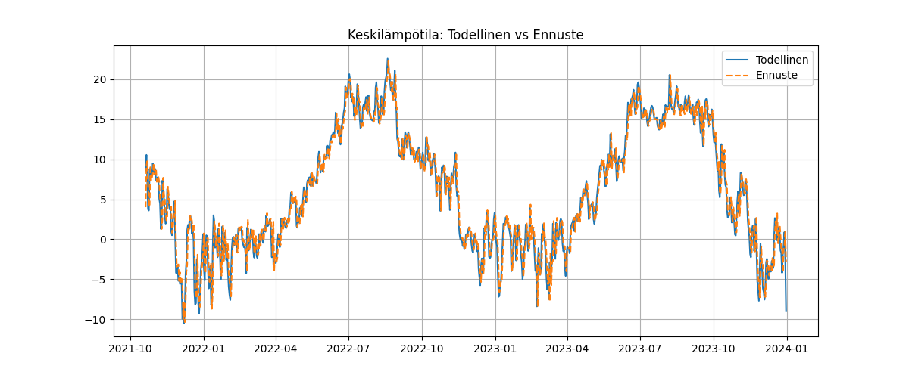

# 🌤️ Weather Pipeline

Tämä projekti lataa Helsingin säähistorian (2013–2023) Open-Meteo API:sta, esikäsittelee datan ja kouluttaa koneoppimismallin ennustamaan seuraavan päivän lämpötilaa.

🧪 Mukana: lineaarinen regressiomalli, viivästetyt piirteet, visualisointi ja mallin tallennus.

---

## 🔧 Vaiheet

1. **Hae data** – Open-Meteo API:sta päivittäinen säädata
2. **Esikäsittele** – Laske keskilämpötila ja viivästetyt ominaisuudet
3. **Treenaa malli** – LinearRegression (scikit-learn)
4. **Arvioi** – Ennusta testijakso ja piirrä kuva
5. **Tallenna** – Malli `.pkl`-tiedostona ja kuva `.png`:nä

---

## 🖼️ Ennusteen visualisointi

---

## ▶️ Käyttö

📍 Avaa Colabissa yllä olevasta napista tai aja notebook paikallisesti.  
Notebook hoitaa datan haun, mallin treenauksen ja piirtää tulokset.  
Tallennetut tiedostot löytyvät `models/` ja `outputs/` -kansioista.

---

## 🚀 Jatkokehitysideoita

- XGBoost- tai LSTM-mallit
- Useamman päivän ennuste
- Sademäärän tai tuulen huomioiminen
- Prefect-ajastus ja automaattinen päivitys

---

## 📄 Lisenssi

Vapaa oppimiskäyttöön. Voit vapaasti muokata ja jakaa.
